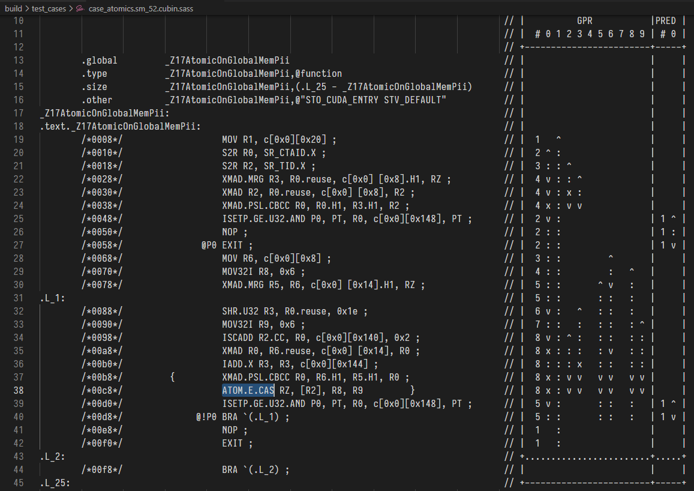
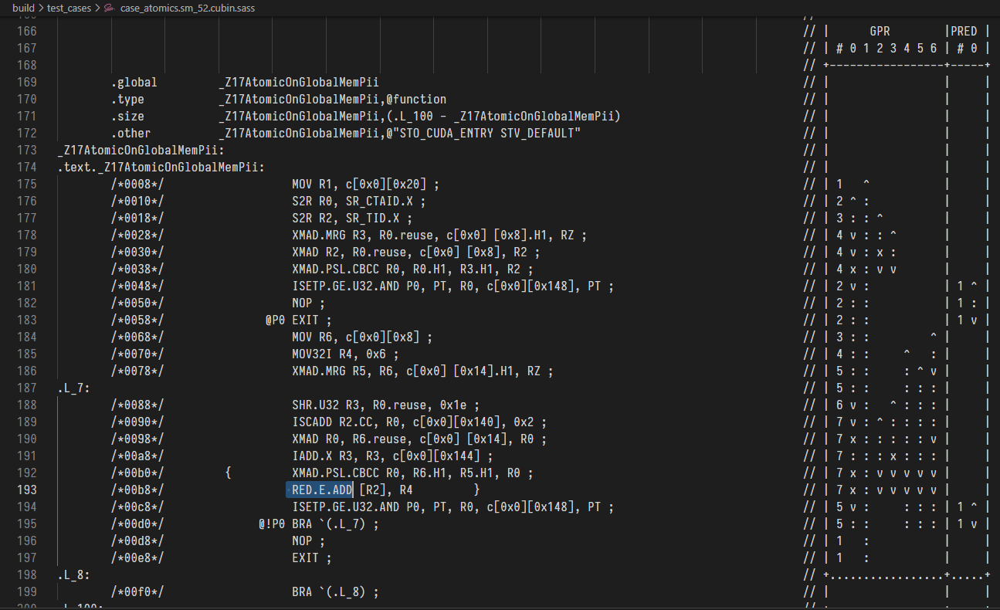

## 1.1 l1tex__average_t_sectors_per_request_pipe_lsu_mem_global_op_atom

英文释义：average # of sectors requested per request sent to T stage for global atomics

中文释义：在Global Mem上做原子操作时，isu单元每个请求的平均sectors数量

测试平台：NVIDIA GeForce RTX 3070 (GA104)

测试条件：一共1个block，32个线程，每个线程对一个int做原子操作atomicExch。

```c
#include <cuda_wrapper.h>
#include <stdio.h>

#define BLOCK_SIZE 32

__global__ void AtomicOnGlobalMem(int *data, int nElem)
{
    unsigned int tid = (blockIdx.x * blockDim.x) + threadIdx.x;
    for (unsigned int i = tid; i < nElem; i += blockDim.x * gridDim.x)
    {
        atomicExch(data + i, 6); 
    }
}

__global__ void WarpAtomicOnGlobalMem(int *data, int nElem)
{
    unsigned int tid = (blockIdx.x * blockDim.x) + threadIdx.x;
    for (unsigned int i = tid; i < nElem; i += blockDim.x * gridDim.x)
    {
        atomicExch(data + (i >> 3), 6); 
    }
}

__global__ void SameAddressAtomicOnGlobalMem(int *data, int nElem)
{
    unsigned int tid = (blockIdx.x * blockDim.x) + threadIdx.x;
    for (unsigned int i = tid; i < nElem; i += blockDim.x * gridDim.x)
    {
        atomicExch(data, 6); 
    }
}

__global__ void AtomicOnSharedMem(int *data, int nElem)
{
    __shared__ int smem_data[BLOCK_SIZE];
    unsigned int tid = (blockIdx.x * blockDim.x) + threadIdx.x;
    for (unsigned int i = tid; i < nElem; i += blockDim.x * gridDim.x)
    {
        atomicExch(smem_data + threadIdx.x, data[i]);
    }
}

int main(void)
{

    const int n = BLOCK_SIZE;//= 2 << 24;
    int *data = new int[n];

    for (int i = 0; i < n; i++)
    {
        data[i] = i % BLOCK_SIZE + 1;
    }

    int *dev_data;
    CudaSafeCall(cudaMalloc((void **)&dev_data, sizeof(int) * size_t(n)));
    CudaSafeCall(cudaMemset(dev_data, 0, sizeof(int) * size_t(n)));
    CudaSafeCall(cudaMemcpy(dev_data, data, n * sizeof(int), cudaMemcpyHostToDevice));

    delete []data;

    {
        dim3 blocksize(BLOCK_SIZE);
        dim3 griddize((n + BLOCK_SIZE - 1)/ BLOCK_SIZE); 
        AtomicOnGlobalMem<<<griddize, blocksize>>>(dev_data, n);
        CudaSafeCall(cudaPeekAtLastError());
    }
    CudaSafeCall(cudaDeviceSynchronize());

    {
        dim3 blocksize(BLOCK_SIZE);
        dim3 griddize((n + BLOCK_SIZE - 1)/ BLOCK_SIZE); 
        WarpAtomicOnGlobalMem<<<griddize, blocksize>>>(dev_data, n);
        CudaSafeCall(cudaPeekAtLastError());
    }
    CudaSafeCall(cudaDeviceSynchronize());

    {
        dim3 blocksize(BLOCK_SIZE);
        dim3 griddize((n + BLOCK_SIZE - 1)/ BLOCK_SIZE); 
        SameAddressAtomicOnGlobalMem<<<griddize, blocksize>>>(dev_data, n);
        CudaSafeCall(cudaPeekAtLastError());
    }
    CudaSafeCall(cudaDeviceSynchronize());

    {
        dim3 blocksize(BLOCK_SIZE);
        dim3 griddize((n + BLOCK_SIZE - 1)/ BLOCK_SIZE); 
        AtomicOnSharedMem<<<griddize, blocksize>>>(dev_data, n);
        CudaSafeCall(cudaPeekAtLastError());
    }
    CudaSafeCall(cudaDeviceSynchronize());

    CudaSafeCall(cudaFree(dev_data));
    CudaSafeCall(cudaDeviceReset());
    printf("Program finished without error.\n");
    return 0;
}
```

测试内容：四次测试，分别实现32个Global地址、4个Global地址、1个Global地址和Shared地址的原子操作

测试结果：sector/request 分别为4， 8，32，0

结果分析： 

1. 32个Global地址：实际上每个线程操作的都是不同的地址，所以对128字节地址只需要4个sector和一个request，故比值为4
2. 4个Global地址：每8个线程操作同一个地址，所以至少会对这些4个地址做8次R-M-W操作，每次一个sector即可所以需要8个sector
3. 1个Global地址：同理，需要32个sector
4. Shared地址上的原子操作：无法通过这个metrics衡量，所以为0

测试指令：

```c
sudo $(which ncu) --metrics l1tex__average_t_sectors_per_request_pipe_lsu_mem_global_op_atom,smsp__sass_l1tex_t_sectors_pipe_lsu_mem_global_op_atom,l1tex__t_requests_pipe_lsu_mem_global_op_atom ./bin/case_atom
```

测试指标具体结果：

```c
    Section: Command line profiler metrics
    ---------------------------------------------------------------------- --------------- ------------------------------
    l1tex__average_t_sectors_per_request_pipe_lsu_mem_global_op_atom.pct                 %                          12.50
    l1tex__average_t_sectors_per_request_pipe_lsu_mem_global_op_atom.ratio  sector/request                              4
    l1tex__t_requests_pipe_lsu_mem_global_op_atom.avg                              request                           0.02
    l1tex__t_requests_pipe_lsu_mem_global_op_atom.max                              request                              1
    l1tex__t_requests_pipe_lsu_mem_global_op_atom.min                              request                              0
    l1tex__t_requests_pipe_lsu_mem_global_op_atom.sum                              request                              1
    smsp__sass_l1tex_t_sectors_pipe_lsu_mem_global_op_atom.avg                      sector                           0.02
    smsp__sass_l1tex_t_sectors_pipe_lsu_mem_global_op_atom.max                      sector                              4
    smsp__sass_l1tex_t_sectors_pipe_lsu_mem_global_op_atom.min                      sector                              0
    smsp__sass_l1tex_t_sectors_pipe_lsu_mem_global_op_atom.sum                      sector                              4
    ---------------------------------------------------------------------- --------------- ------------------------------

  WarpAtomicOnGlobalMem(int *, int), 2022-Jan-19 10:47:09, Context 1, Stream 7
    Section: Command line profiler metrics
    ---------------------------------------------------------------------- --------------- ------------------------------
    l1tex__average_t_sectors_per_request_pipe_lsu_mem_global_op_atom.pct                 %                             25
    l1tex__average_t_sectors_per_request_pipe_lsu_mem_global_op_atom.ratio  sector/request                              8
    l1tex__t_requests_pipe_lsu_mem_global_op_atom.avg                              request                           0.02
    l1tex__t_requests_pipe_lsu_mem_global_op_atom.max                              request                              1
    l1tex__t_requests_pipe_lsu_mem_global_op_atom.min                              request                              0
    l1tex__t_requests_pipe_lsu_mem_global_op_atom.sum                              request                              1
    smsp__sass_l1tex_t_sectors_pipe_lsu_mem_global_op_atom.avg                      sector                           0.01
    smsp__sass_l1tex_t_sectors_pipe_lsu_mem_global_op_atom.max                      sector                              1
    smsp__sass_l1tex_t_sectors_pipe_lsu_mem_global_op_atom.min                      sector                              0
    smsp__sass_l1tex_t_sectors_pipe_lsu_mem_global_op_atom.sum                      sector                              1
    ---------------------------------------------------------------------- --------------- ------------------------------

  SameAddressAtomicOnGlobalMem(int *, int), 2022-Jan-19 10:47:09, Context 1, Stream 7
    Section: Command line profiler metrics
    ---------------------------------------------------------------------- --------------- ------------------------------
    l1tex__average_t_sectors_per_request_pipe_lsu_mem_global_op_atom.pct                 %                            100
    l1tex__average_t_sectors_per_request_pipe_lsu_mem_global_op_atom.ratio  sector/request                             32
    l1tex__t_requests_pipe_lsu_mem_global_op_atom.avg                              request                           0.02
    l1tex__t_requests_pipe_lsu_mem_global_op_atom.max                              request                              1
    l1tex__t_requests_pipe_lsu_mem_global_op_atom.min                              request                              0
    l1tex__t_requests_pipe_lsu_mem_global_op_atom.sum                              request                              1
    smsp__sass_l1tex_t_sectors_pipe_lsu_mem_global_op_atom.avg                      sector                           0.01
    smsp__sass_l1tex_t_sectors_pipe_lsu_mem_global_op_atom.max                      sector                              1
    smsp__sass_l1tex_t_sectors_pipe_lsu_mem_global_op_atom.min                      sector                              0
    smsp__sass_l1tex_t_sectors_pipe_lsu_mem_global_op_atom.sum                      sector                              1
    ---------------------------------------------------------------------- --------------- ------------------------------

  AtomicOnSharedMem(int *, int), 2022-Jan-19 10:47:09, Context 1, Stream 7
    Section: Command line profiler metrics
    ---------------------------------------------------------------------- --------------- ------------------------------
    l1tex__average_t_sectors_per_request_pipe_lsu_mem_global_op_atom.pct                 %                              0
    l1tex__average_t_sectors_per_request_pipe_lsu_mem_global_op_atom.ratio  sector/request                              0
    l1tex__t_requests_pipe_lsu_mem_global_op_atom.avg                              request                              0
    l1tex__t_requests_pipe_lsu_mem_global_op_atom.max                              request                              0
    l1tex__t_requests_pipe_lsu_mem_global_op_atom.min                              request                              0
    l1tex__t_requests_pipe_lsu_mem_global_op_atom.sum                              request                              0
    smsp__sass_l1tex_t_sectors_pipe_lsu_mem_global_op_atom.avg                      sector                              0
    smsp__sass_l1tex_t_sectors_pipe_lsu_mem_global_op_atom.max                      sector                              0
    smsp__sass_l1tex_t_sectors_pipe_lsu_mem_global_op_atom.min                      sector                              0
    smsp__sass_l1tex_t_sectors_pipe_lsu_mem_global_op_atom.sum                      sector                              0
    ---------------------------------------------------------------------- --------------- ------------------------------
```

关于不同原子操作：如果把atomicExch()换成atomicAdd()，测试结果完全不一样，上述各项指标均为零，就好像atomicAdd()不是”atomic op"一样， 进一步测试会发现，貌似只有atomicCAS()和atomicExch()属于"atomic op"，其它的都不算，纳尼？

atomicAdd()和atomicExch()的汇编指令看起来确实像"atomic op":

```assembly
atom.global.exch.b32 	%r10, [%rd1], 6; // atomicExch()
atom.global.add.s32     d,[a],6;		// atomicAdd()
```

被这个问题折磨很久，做了很多测试，尝试各种编译姿势，最终还是论坛老哥给力（[传送门](https://forums.developer.nvidia.com/t/is-there-a-difference-between-atomicadd-and-atomicexch-in-hardware-implementation/200744)），原来Nsight Compute的这些metrics衡量的并不是高级CUDA-C语言的操作函数，而是真正的SASS指令，比如这里的atomicExch()底层实现是 ATOMG.E.EXCH，而atomicAdd()却是通过RED.E.ADD来实现，所以atomicAdd()并不能用”l1tex__average_t_sectors_per_request_pipe_lsu_mem_global_op_atom"这个metric来衡量性能。

简单验证一下，在nvcc编译时加一条-keep让它保存中间结果

```cmake
add_compile_options(-keep)
```

然后找到生成的.cubin二进制文件，用nvdisasm把它反编译得到SASS指令

```bash
nvdisasm -c -plr ./case_atomics.sm_52.cubin >case_atomics.sm_52.cubin.sass
```

可以看到，它们分别是ATOMG.E.EXCH和RED.E.ADD，atomicAdd()确实不是"atomic op":





看来，实战中还是要注意，CUDA-C和SASS指令并不完全相关。


## 1.2 l1tex__average_t_sectors_per_request_pipe_lsu_mem_global_op_red

英文释义：

中文释义：

测试平台：

测试条件：

```c

```

测试内容：

测试结果：

结果分析：

测试源代码：

```c

```

测试指令：

```c

```

测试指标具体结果：

```c

```

## 1.3 l1tex__average_t_sectors_per_request_pipe_lsu_mem_global_op_ld

英文释义：

中文释义：

测试平台：

测试条件：

```c

```

测试内容：

测试结果：

结果分析：

测试源代码：

```c

```

测试指令：

```c

```

测试指标具体结果：

```c

```

## 1.4 l1tex__average_t_sectors_per_request_pipe_lsu_mem_global_op_st

英文释义：

中文释义：

测试平台：

测试条件：

```c

```

测试内容：

测试结果：

结果分析：

测试源代码：

```c

```

测试指令：

```c

```

测试指标具体结果：

```c

```

## 1.5 l1tex__average_t_sectors_per_request_pipe_lsu_mem_local_op_ld

英文释义：

中文释义：

测试平台：

测试条件：

```c

```

测试内容：

测试结果：

结果分析：

测试源代码：

```c

```

测试指令：

```c

```

测试指标具体结果：

```c

```

## 1.6 l1tex__average_t_sectors_per_request_pipe_lsu_mem_local_op_st

英文释义：

中文释义：

测试平台：

测试条件：

```c

```

测试内容：

测试结果：

结果分析：

测试源代码：

```c

```

测试指令：

```c

```

测试指标具体结果：

```c

```


